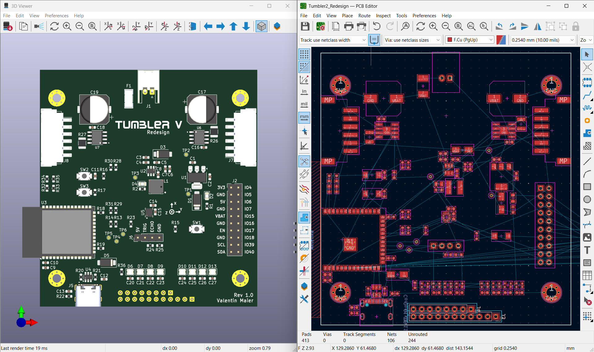
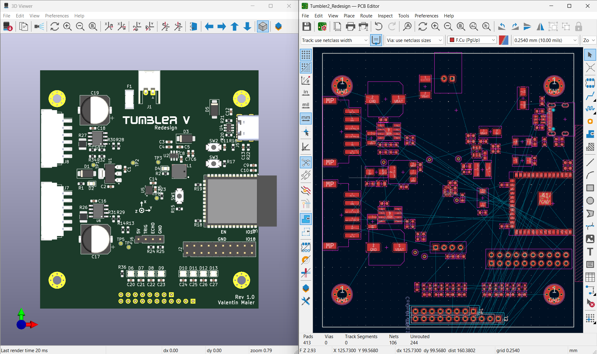
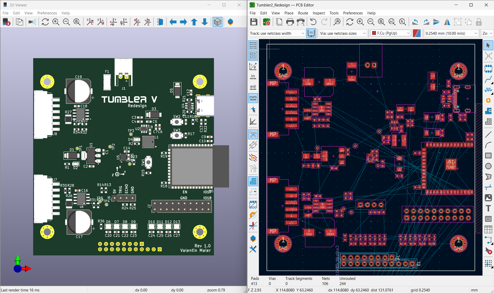

# Tumbler 2 `ultra-low-cost`

Single USB port variant of the `Tumbler 2` redesign, optimized for maximum cost reduction.

## Changes

| Original Design                      | Redesign Improvement                             |
| ------------------------------------ | ------------------------------------------------ |
| Unfused battery supply               | Add slow-blow fuse directly at connector         |
| 5 V to 3.3 V LDO regulator           | 5 V to 3.3 V buck converter                      |
| WROOM module with ESP32-D0WD-V3      | WROOM module with ESP32-S3                       |
| CH340 for USB-UART Bridge            | Directly connect to ESP32 DP/DN                  |
| 100 nF capacitors on BTN and GPIO0   | Removed unnecessary capacitors on BTN and GPIO0  |
| USB-C shield directly to signal GND  | Low impedance 100nF to avoid ground loops        |
| Use Obsolete MPU6050 breakout module | Use LSM6DSV directly on PCB                      |
| Use TB6612FNG breakout module        | Use 2x TB67H450FNG directly on PCB               |
| 5 V ECHO signal directly to ESP32    | Voltage divider to 3.3 V ESP32 GPIO              |
| 5 V Encoder signal directly to ESP32 | Voltage divider to 3.3 V ESP32 GPIO              |
| No local decoupling for WS2812B LEDs | Added proper local bypass capacitors for WS2812B |

## Discarded Ideas

| Idea                                            | Reason                                                    |
| ----------------------------------------------- | --------------------------------------------------------- |
| On-board charging circuit (IP5306, BQ25887RGER) | Not required. External USB charger included with battery  |
| Additional LDO for clean 3.3 V rail             | Not necessary. ESP32-WROOM internal VCC/VCCA already tied |

## Layout Options

| Layout A                                                                          | Layout B                                                                               | Layout C                                                                             |
| --------------------------------------------------------------------------------- | -------------------------------------------------------------------------------------- | ------------------------------------------------------------------------------------ |
|  Preferred option |  Left–right separation |  Looser version of B |
